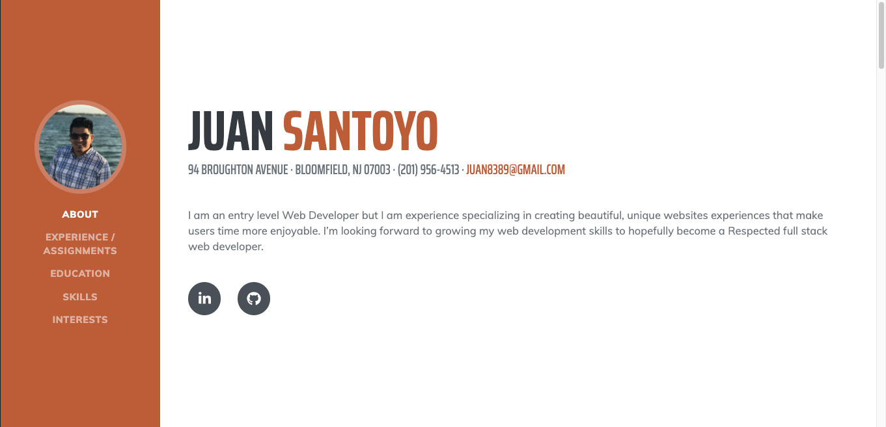

# santoyo.github.io
# JS Portfolio# 

## Table of Contents

* [Description](#Description)
* [Challenges](#Challenges)
* [Tools](#Tools)

## Description 

This Assignment was mainly to show our connecting with getbootstrap.com and all the skills that we have learn so far.
All the links for this website are working properly. The contanct information for the footer will take you back to about tag, and all pictures will take you to the assignments. all social media tags will take to linkedin and github.

https://juan8389.github.io/Juan_Santoyo_portafolio/
 

## Challenges

This assignment was challenging and fun. It is the first homework that we used Javascript, HTML, and CSS.

## Tools 

I used getbootstrap and W3schools most important my notes and class work.
